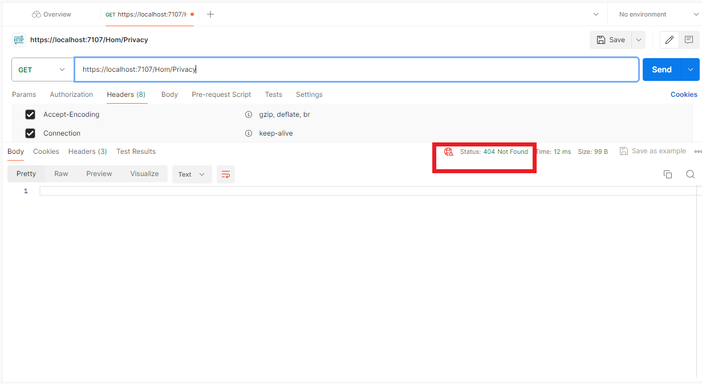
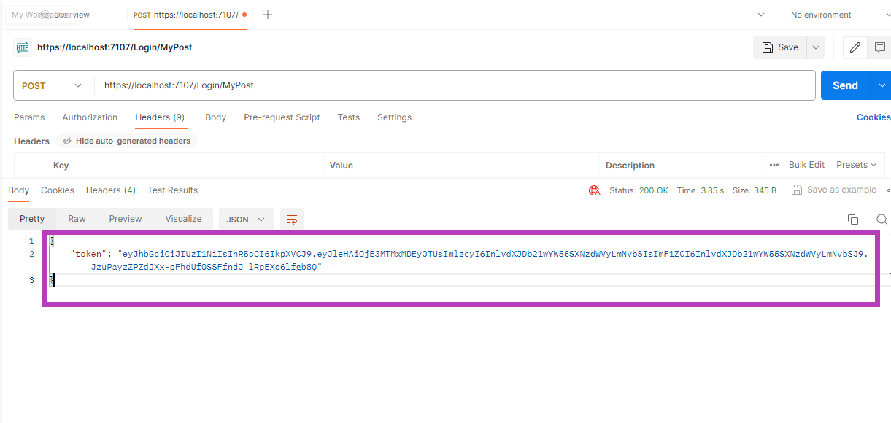
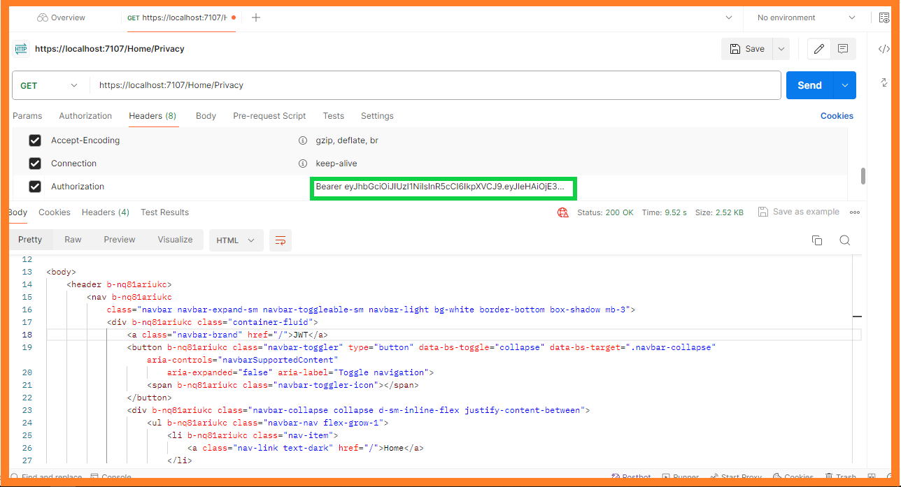

# JWT# 🚀 JWTAuthAPI

Welcome to JWTAuthAPI! This project is an ASP.NET Core Web API with JWT authentication.

## 📋 Introduction

JWTAuthAPI is a simple ASP.NET Core Web API project that demonstrates JWT authentication. It provides endpoints for user authentication and generates JWT tokens for authorized users.

## 🚀 Usage

### Before Authorization

### Token Generation

### After Authorization

## 📄 License

This project is licensed under the MIT License - see the [LICENSE.md](LICENSE.md) file for details

## 🙏 Acknowledgments

[Medium Article](https://medium.com/@vndpal/how-to-implement-jwt-token-authentication-in-net-core-6-ab7f48470f5c)